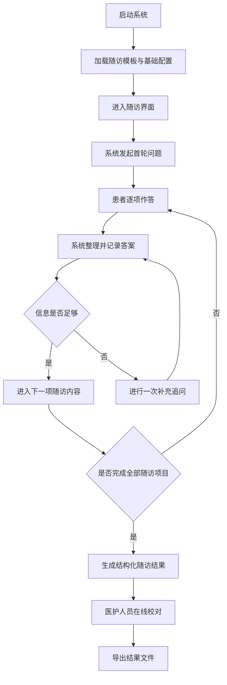
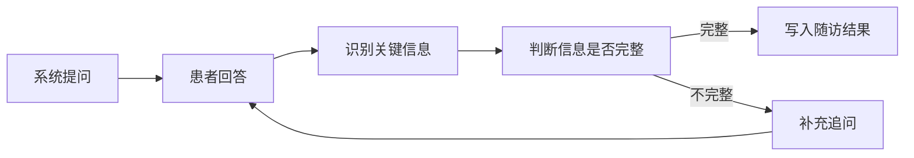
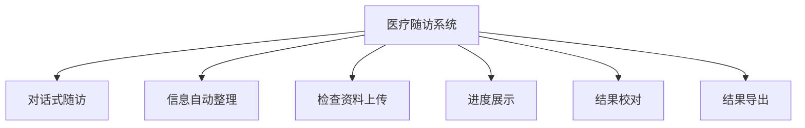

# 医疗随访系统运行流程图

## 文档说明

本文档面向比赛评审使用，重点说明系统的实际运行流程和主要功能，不展开具体代码实现细节。

## 一、系统运行主流程

## 二、核心功能流程

### 1. 对话式信息采集流程

说明：

- 系统按照预设随访顺序逐项提问。
- 对于已经足够明确的信息，系统直接记录，不反复追问。
- 对于暂时无法确认的信息，系统允许保留待补充状态。

### 2. 检查资料上传流程

说明：

- 支持上传常见文档和图片格式的检查资料。
- 上传功能主要用于资料留存和后续核对，不替代医生判断。

### 3. 结果校对与导出流程

说明：

- 系统生成的是结构化初稿，保留人工复核环节。
- 最终结果可以导出，便于存档、统计和后续使用。

## 三、系统功能概览

各功能模块作用如下：

- 对话式随访：通过问答方式逐步完成信息采集，降低填写门槛。
- 信息自动整理：把患者回答整理为结构化内容，减少重复录入。
- 检查资料上传：支持补充化验单、检查报告等材料。
- 进度展示：显示当前随访完成情况，便于掌握整体进展。
- 结果校对：支持人工审核与修正，保证结果更稳妥。
- 结果导出：形成可保存、可复用的随访结果文件。

## 四、运行特点

1. 系统采用“逐项提问、逐项记录”的方式，流程清晰，便于患者配合。
2. 对不完整信息支持补充追问，但不过度追问，尽量保持交互简洁。
3. 结果生成后保留人工校对环节，适合医疗场景下的审慎使用要求。
4. 支持检查资料上传和结果导出，便于形成较完整的随访记录。
5. 系统定位是随访信息采集与整理辅助工具，不替代临床诊断与医生决策。
